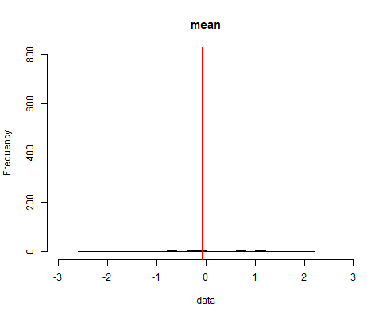

```{r setup, include=FALSE}
knitr::opts_chunk$set(echo = FALSE)
```

## 2.The bell-shaped curve

- When the data is normal distributed, its shape is like a bell.
- Examples: 

     heights of people
 
     bloodpressure measurments
 
     weight of cheerios
- About this project

We show how we got the bell shaped curve by increasing the number of bins.

## ui.R

```r
library(shiny)
shinyUI(fluidPage(
    titlePanel("Plot normal distribution"),
    sidebarLayout(
        sidebarPanel(
            sliderInput("bins","Number of bins:(slide the bar from the left to the right slowly to see how the histgram changes)",
            min = 1,max = 10000,value = 30)
        ),
        mainPanel(
            h3("Normal Distribution"),
            plotOutput("plot1")
        )
    )
))
```

## server.R

```r
library(shiny)
shinyServer(function(input, output) {
    output$plot1 <- renderPlot({
        set.seed(2134)
        number_of_points <- input$bins
        data <- rnorm(number_of_points)
        hist(data,xlim = c(-3,3),ylim = c(0,800),main = "mean",
              col = "grey",breaks = 30)
        output$mean <- renderText(mean(data))       
        abline(v=mean(data),col = "red")
    })
})
```

## Result



